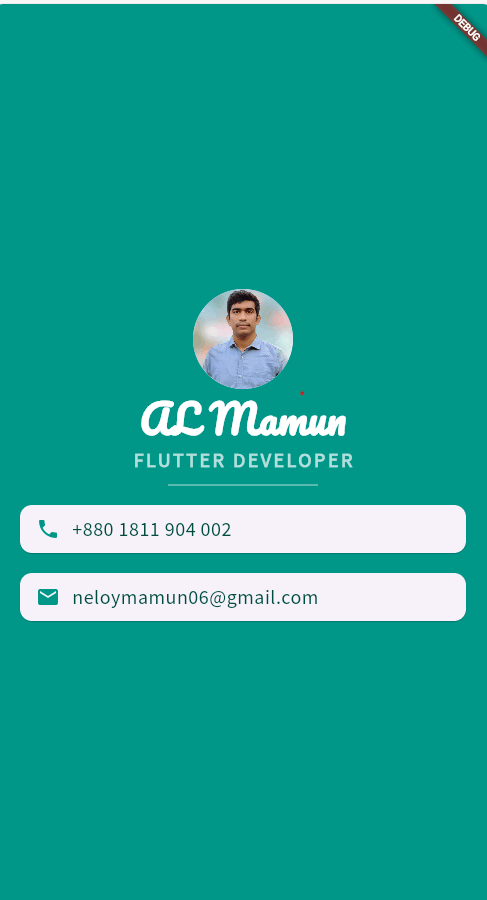

<h1 align="center">Hi 👋, Flutter-Business-Card-Project </h1>
✅ এই ভিডিওতে যা শিখবেন:
✔️ GitHub থেকে Flutter প্রোজেক্ট কিভাবে ক্লোন করবেন
✔️ Git এবং GitHub ব্যবহার করে কোড ডাউনলোড করা
✔️ VS Code এবং Android Studio তে Flutter প্রোজেক্ট ওপেন করা
✔️ flutter pub get কমান্ড ব্যবহার করে dependencies ফিক্স করা
✔️ Flutter প্রোজেক্ট রান করা
1 step: Download this project</br>
2 step: extract here folder </br>
3 step: go to assets folder and extract images folder </br>
4 step: go to lib folder and see 4 files </br>
- lib folder details 
   ```
   
   1 step: main.dart
   2 step:gradient_container
   3 step: styling_text
   4 step: dice_roller   
   ```
